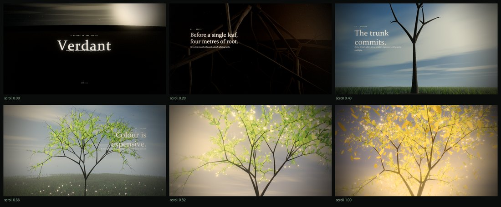
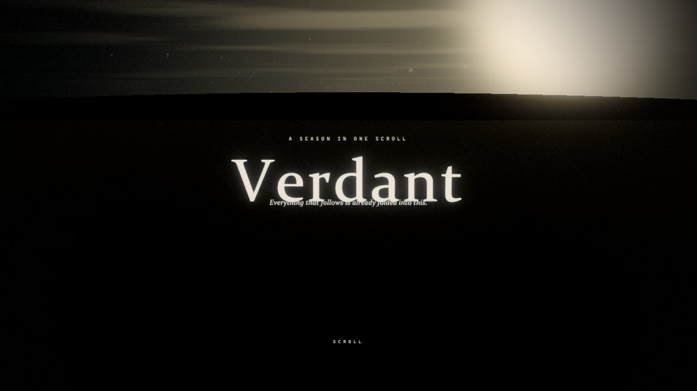
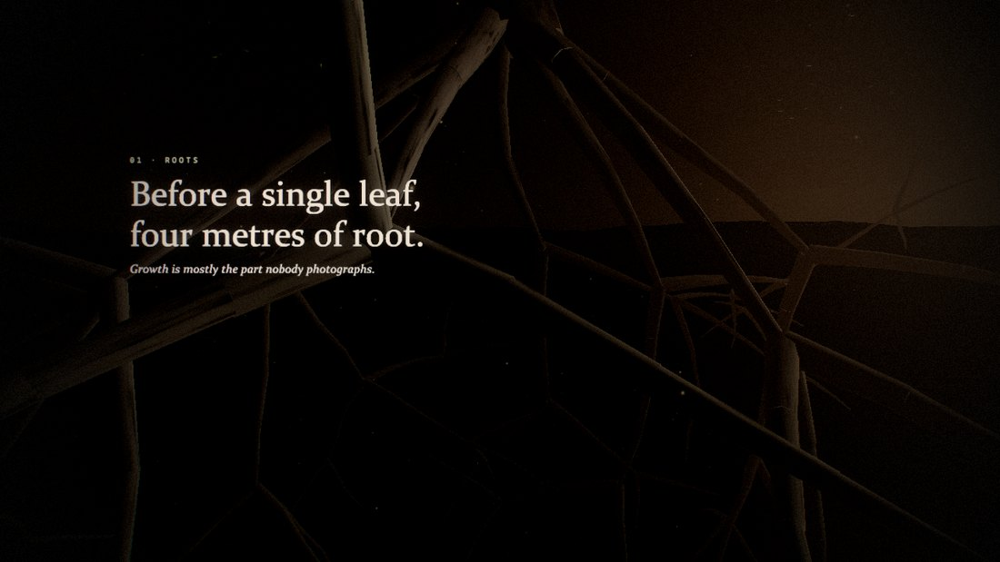
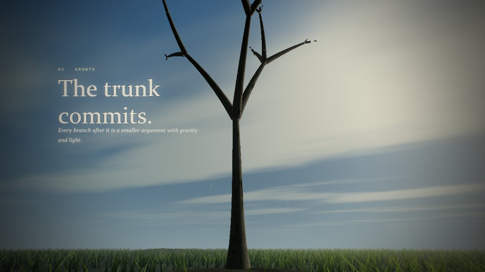
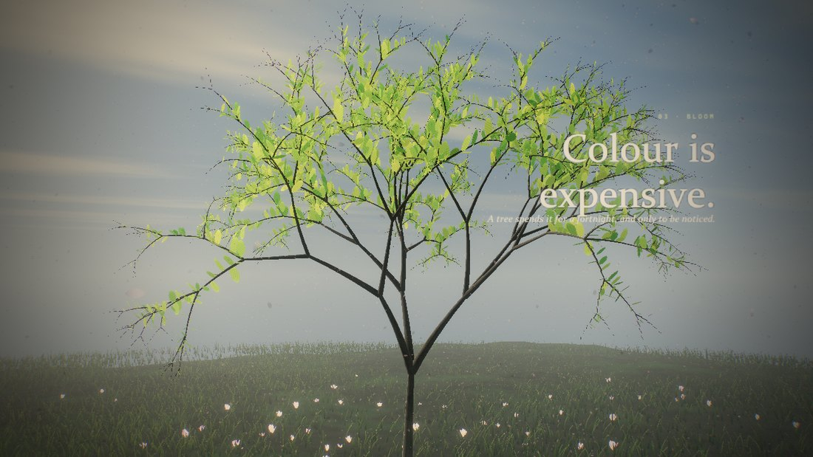

# Verdant — a season in one scroll

**Live: [acidalchamy.com/verdant](https://acidalchamy.com/verdant/)**

A scroll-driven WebGL film about a single tree, written from scratch to work out
how sites like [activetheory.net](https://activetheory.net) are built.

There are **no photographs, no 3D models, no textures and no libraries**. Every
pixel is generated on the GPU from about 1,100 lines of GLSL, and every glyph is
rasterised into an atlas at boot. The whole thing is 95 KB of JavaScript.



```bash
python serve.py
```

Then open <http://localhost:8931> and scroll.

|  |  |
|---|---|
|  |  |
|  |  |
|  |  |

---

## What it does

| Scroll | Route | Beat |
|---|---|---|
| 0.00 | `/` | A seed on dark ground under stars. Title. |
| 0.15 | `/roots` | The camera drops below the soil. Roots spread first. |
| 0.36 | `/growth` | The trunk commits and pushes up into a cloudy sky. |
| 0.58 | `/bloom` | Leaves unfurl, blossom opens, pollen drifts. |
| 0.80 | `/canopy` | Golden hour, full canopy, the first leaves let go. |

The URL rewrites itself as you scroll, and every route deep-links back to that
exact frame.

---

## The techniques, and where each came from

Each of these is a thing Active Theory's site does; the notes are how this
implementation does it.

### 1. The document is empty

`index.html` is 5 KB and its `<body>` contains one empty `<div>`, a loading veil,
and one anchor — the GitHub badge in the corner, which is DOM on purpose: a link
should be focusable, middle-clickable and readable by things that are not
browsers. Everything else you see is drawn into a single canvas.

The inline boot script is a **hard support gate** — modern syntax plus WebGL2, or
you get a message instead of a broken page. No polyfills, no ES5 build.

### 2. Text is geometry, not DOM — `src/03-text.js`

`GLText` rasterises each typeface into a **glyph atlas** on a 2D canvas, records
per-glyph advances and UV rects, then lays out lines itself: word wrap, tracking,
line height, baselines, alignment. Each character becomes one instance in a
single batched draw, so a whole paragraph is one draw call and every letter can
animate independently.

Two details that took the most iterating:

- **Sizing is viewport-relative**, like CSS. `size` is a fraction of viewport
  height and everything else is in ems, so the layout survives any window shape.
- **Blocks are anchored in camera space**, not world space. A block at anchor
  `[-0.74, 0.44]` lands in the same part of the composition regardless of where
  the camera is or what the focal length is doing.

Legibility over a blown-out canopy is solved by reading a **coarse mip of the
same atlas** as a soft dark scrim behind the letter — one extra texture tap
instead of eight dilation samples.

### 3. A hidden, real DOM for crawlers and screen readers — `src/06-scroll.js`

Because nothing is in the document, `SEO.build()` constructs a parallel semantic
tree — `h1`, `h2` per chapter, real `<a href>` navigation, body copy — inside a
container clipped to zero pixels. `aria-current` follows the chapter you are
looking at. Verified: 188 words, 5 headings, 5 working links, 0 px wide.

### 4. One shader file, one request — `assets/shaders/compiled.vs`

All 30-odd shaders live in a single file delimited `{@}name.fs{@}`, with
`#!ATTRIBUTES` / `#!UNIFORMS` / `#!VARYINGS` / `#!SHADER` pragma sections. The
loader in `src/02-gl.js` resolves shared chunks (`common`, `curl`, `sdf`,
`lighting`, `atmos`, `wind`) by scanning each shader for the symbols it actually
references, then prepends only those. Compile errors print with numbered source
context — which is how the two real bugs in this build were found in seconds.

### 5. Growth is a uniform, not a rebuild — `src/04-world.js`

The tree is a seeded recursive L-system: ~4,600 branch segments and ~20,000
leaves, generated **once** at boot. Each element carries a `birth` time
normalised by **arc length from the root**, so the growth front travels outward
at constant speed rather than one generation at a time.

Scrolling changes a single float. The vertex shader compares it against `birth`
and extends each segment from its start point. The CPU never touches the tree
again — no buffer rewrites, no re-generation, no allocation during scroll.

### 6. GPGPU particles with analytic curl noise — `assets/shaders/compiled.vs`

Particle position and life live in a floating-point texture. Each frame a
fullscreen pass advances every particle and writes to its twin; the draw pass
samples that texture per instance. Up to 32k particles, zero CPU involvement.

The flow field is the **curl of an analytic trigonometric potential**. The usual
approach samples 3D simplex noise four times to approximate the partial
derivatives — roughly 96 trig calls. Because the potential here is built from
sines directly, the partials are known in closed form: 18 trig calls, and exactly
divergence-free rather than approximately.

Particles morph through four modes as the film advances — dust, pollen, petals,
fireflies — with the opacity dipping at each boundary to hide the swap.

### 7. Grade as data, with the editor shipped — `src/07-uil.js`

Every art-directed number lives in a `Tune` store with a type and a range:
**158 parameters**, including a full per-chapter colour grade (exposure, bloom,
lift/gamma/gain, split tone, saturation, contrast, vignette, grain, aberration,
sky, fog, sun, clouds). Looks are keyframed per chapter and lerped by scroll.

`?uil` opens a tuning panel that **builds itself from that schema** — 99 sliders
and 59 colour pickers — updates the running film live, and exports the whole set
back to `assets/data/tune.json`, which is loaded over the code defaults at boot.
This is the single biggest reason the reference site looks the way it does: the
engine is the same for everyone, and the taste is data.

### 8. Post chain — `src/05-post.js`

Scene → soft-knee bright pass → dual-filter downsample pyramid (13-tap) →
upsample with accumulation → radial god rays marched toward the projected sun →
ACES tonemap → ASC-CDL grade → split tone → vignette → luminance-only grain,
heavier in the shadows → ordered dither to kill banding in the big gradients.

### 9. One render loop, refresh-rate normalised — `src/01-core.js`

A single `requestAnimationFrame` authority. It samples 40 frames, takes the
**median** (not the mean — one hitch shouldn't define the display), and exposes
`HZ_MULTIPLIER = 60 / REFRESH_RATE`. Delta is clamped to 100 ms so a tab-out
can't fire a huge timestep into the simulation.

### 10. Grade the hardware before drawing

`Device.detect()` reads `WEBGL_debug_renderer_info` and grades the GPU into four
tiers, which set particle count, grass count, bloom depth, ray samples, leaf
density, branch tessellation and DPR cap. On top of that a **governor** watches
frame time and drops render scale after two seconds of missed budget, restoring
it after four seconds of comfort.

### 11. Scroll *is* the router

A native scroll container drives a smoothed value; the smoothing is
frame-rate-independent, which is what turns Windows' steppy 100 px wheel deltas
into a dolly move. Chapter boundaries call `history.replaceState` — the address
bar always describes what you are looking at, without filling the back stack.

---

## Debug flags

Append to any URL:

```
?uil        the tuning editor (99 sliders, live, exports JSON)
?stats      fps / tier / draw calls / scroll / growth HUD
?tier=0..3  force a quality tier
?log        boot stage timing
?noadapt    disable the adaptive resolution governor
```

`window.VERDANT` exposes `App`, `Tune`, `Shaders`, `Tree`, `Device`, `Render`,
`Scroll` in the console.

---

## Build and capture

```bash
python build.py
python build.py --base /verdant/ --out ../site/app/verdant
```

Concatenates `src/*.js` in filename order into one stamped IIFE bundle and
rewrites the `_CACHE_` stamp in `index.html`.

`--base` sets the mount path: it rewrites `<base href>` and `window._BASE_`, and
the router prefixes every route with it, so the same source runs at the root of a
domain or under a sub-path. `--out` copies just the runtime (no sources, no build
scripts, no captures) to a deploy directory.

```bash
python capture.py 0.0 0.46 0.82
```

Drives the film in headless Chromium, seeks to each scroll position, waits for
the smoothed scroll and per-character reveals to settle, writes a still per mark
and stitches a contact sheet to `captures/_contact.png`. It asks for the real
ANGLE/D3D11 path — headless Chromium otherwise falls back to SwiftShader, which
renders this in minutes rather than milliseconds.

---

## Numbers

| | |
|---|---|
| HTML shell | 4.0 KB |
| JS bundle | 95 KB (8 modules, one request) |
| Shader bundle | 36 KB (30 shaders, one request) |
| Tuned parameters | 158 |
| Branch segments | ~4,600 (instanced, one draw call) |
| Leaves | ~20,000 (instanced, one draw call) |
| Grass blades | 14k–110k by tier (instanced, one draw call) |
| Particles | 4k–32k, simulated entirely on the GPU |
| Draw calls per frame | 23–25 |
| Image assets | 0 |
| Runtime dependencies | 0 |

Measured at 1440×900: **45 fps at tier 0**, 39 fps on a 390×844 phone viewport.

---

## Deploying

It is fully static. The only server requirement is a **SPA fallback**: unknown
paths without a file extension must serve `index.html`, or `/roots` 404s. That is
`serve.py` locally, `_redirects` on Netlify/Cloudflare Pages, `try_files` on
nginx, or a rewrite rule on S3+CloudFront.

Assets are stamped (`verdant.<build>.js`) so they can be cached immutably.

For a sub-path deployment, build with `--base` and add the same fallback scoped
to that prefix. The live copy runs behind nginx:

```nginx
location ^~ /verdant/ {
    try_files $uri $uri/ /verdant/index.html;
    location ~* \.vs$ { default_type text/plain; expires 7d; }
    location ~* \.(?:js|css|png|jpe?g|svg|ico|webp)$ { expires 30d; access_log off; }
}
```

---

## Credit

The techniques here are my own implementations of ideas demonstrated by
[Active Theory](https://activetheory.net) — WebGL-rendered typography, a hidden
semantic DOM, a single delimited shader bundle, art direction stored as data with
the editor shipped alongside it. No code was taken from their site; this repository
is an independent reimplementation written to understand how those pieces fit
together. Not affiliated with or endorsed by Active Theory.

MIT licensed — see [LICENSE](LICENSE).
